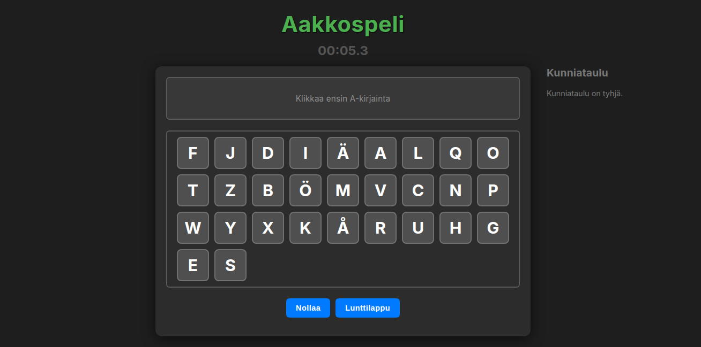

# Aakkospeli

A browser game for practicing the Finnish alphabet. The player clicks shuffled letter cards in the correct order from A to Ö, races against a timer, and can save local high scores.



## Live demo

GitHub Pages:

https://pnaaberi.github.io/aakkospeli/

## Why this exists

This is a small AI-assisted / vibe-coded learning game prototype. It is intentionally simple: one static HTML file, no backend, no build pipeline, and no user accounts.

The point was to see how quickly an idea could become a playable browser demo with AI help, then polish it enough to be understandable as a portfolio artifact.

## Features

- Finnish alphabet order: A-Z plus Å, Ä, Ö
- Shuffled clickable letter cards
- Start screen, reset button, and alphabet cheat sheet
- Timer with tenths of a second
- Completion screen with name entry
- Local hall of fame stored in `localStorage`
- Clear-high-scores confirmation dialog when scores exist
- No backend and no build step

## How to play

1. Press `Aloita peli`.
2. Click the visible letters in Finnish alphabet order, starting from `A`.
3. Use `Lunttilappu` if you need to check the full alphabet.
4. Save your time to the local hall of fame after finishing.

## Run locally

Open `index.html` in a browser.

You can also serve it locally:

```bash
python3 -m http.server 8000
```

Then open:

```text
http://localhost:8000
```

## Tools used

- Gemini 2.5 Pro Preview for the first vibe-coded prototype
- Plain HTML, CSS, and JavaScript
- Browser `localStorage` for local high scores
- GitHub Pages for static hosting from the `main` branch

## What I learned

- AI-assisted coding can get a small game prototype working fast, but it still needs human QA.
- Static browser apps are good portfolio artifacts because they are easy to run, inspect, and host.
- Small UX details matter: an empty game state looked broken, so the in-game panel now shows the next expected action.
- Even tiny public repos need basic hygiene: README, screenshot, license, `.gitignore`, and deployment verification.

## Limitations

- Scores are local to the current browser only; there is no shared leaderboard.
- The game does not include audio, levels, accessibility settings, or classroom/teacher controls.
- The timer starts when the game starts, not on the first letter click.
- The UI is a prototype, not a full educational product.
- No analytics or backend logging is included.

## Files

- `index.html` — complete game implementation
- `assets/screenshot.png` — portfolio screenshot
- `LICENSE` — project license

## Data and privacy

Scores are saved only in the current browser via `localStorage` under `aakkospeliHallOfFame`. No personal data is sent to a server.
